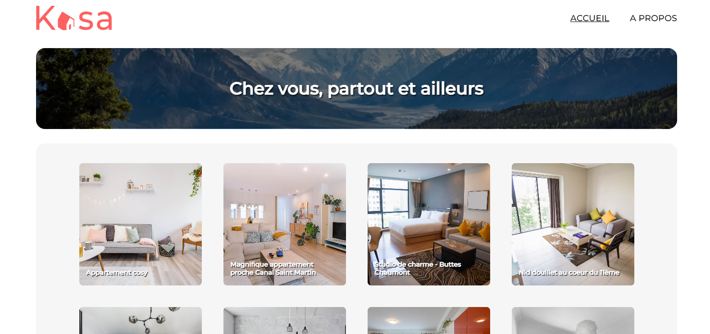

# Site web de location d’appartements  - Kasa
Code du projet 5 du parcours développeur web.

## Utilisation

### `yarn start` ou `npm start`

Ouvrir [http://localhost:3000](http://localhost:3000) pour le visualiser dans votre navigateur.

La page se rechargera lorsque vous apporterez des modifications.\

## Présentation
### Technos

### Scenario 
Vous êtes développeur front-end en freelance pour Kasa, une entreprise de location d’appartements entre particuliers.

### Missions
+ Ajouter React Router
+ Creer les 4 pages selon la maquette
+ Creer un carrousel 
+ Gerer l'erreur sur l'id d'une propriété

